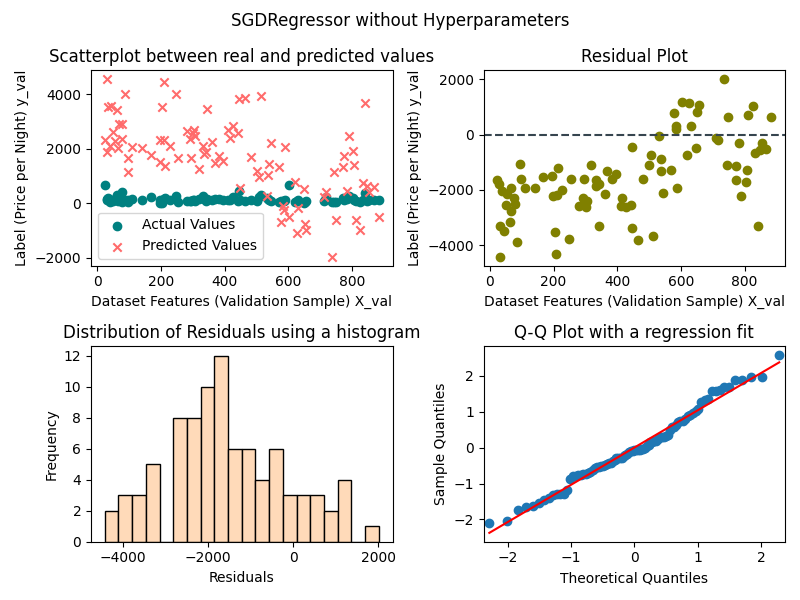
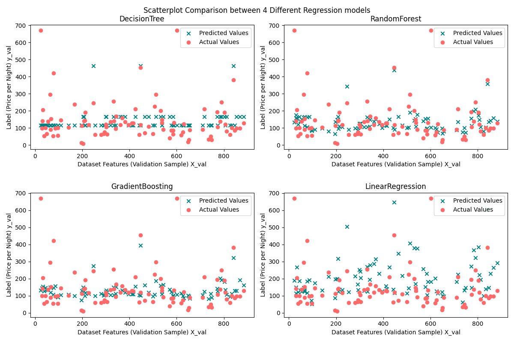
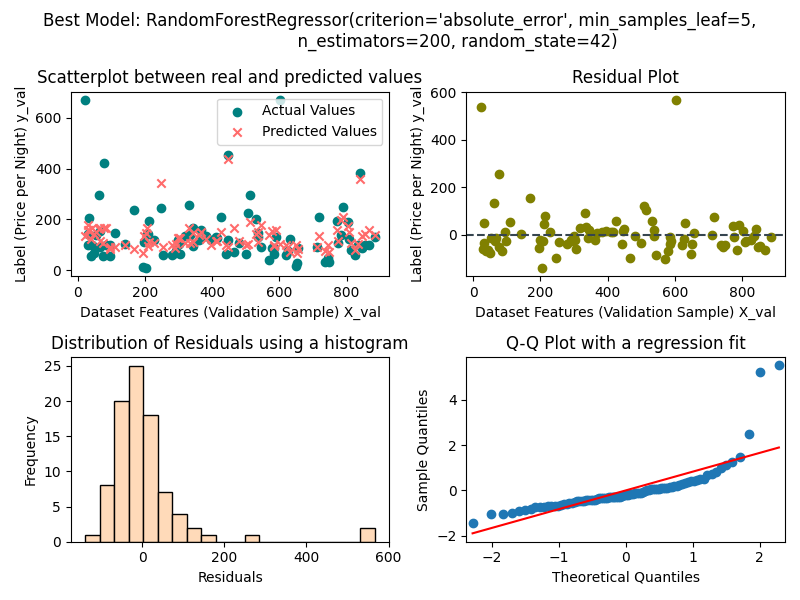

# Modelling_Airbnbs_property_listing_dataset

Welcome to the **Airbnb Model Evaluation Framework**! This project aims to create a versatile framework for systematically training, tuning, and evaluating machine learning models for a wide range of tasks, inspired by the challenges faced by the Airbnb team. Whether you're working with tabular, image, or text data, this framework will help you build effective models and streamline the evaluation process.

## Built With

This project leverages several essential frameworks and tools to achieve its goals:

- [GitHub](https://github.com/) - Hosting and version control for collaborative development.
- [Jupyter Notebook](https://jupyterlab.readthedocs.io/en) - An open source web application that allows you to create and share.
- [Python 3.7](https://www.python.org/downloads) - The programming language used in this project.
- [Pandas](https://pandas.pydata.org/) - Data manipulation and analysis in Python.
- [Scikit-Learn](https://scikit-learn.org/) - Machine learning library in Python.
- [NumPy](https://numpy.org/) - Fundamental package for scientific computing with Python.
- [Joblib](https://joblib.readthedocs.io/) - Efficiently save and load Python objects.
- [JSON](https://www.json.org/) - For storing hyperparameters and performance metrics.
- [GridSearchCV](https://scikit-learn.org/stable/modules/generated/sklearn.model_selection.GridSearchCV.html) - Grid search for hyperparameter tuning.
- [MinMaxScaler](https://scikit-learn.org/stable/modules/generated/sklearn.preprocessing.MinMaxScaler.html) - Feature scaling.
- [Matplotlib](https://matplotlib.org/stable/index.html) - Plotting graphs, charts etc., in Python.
- [TensorBoard](https://www.tensorflow.org/tensorboard) - Tool for visualizing training and performance metrics of neural networks.


## Getting Started

To get started with the Airbnb Model Evaluation Framework, follow these steps:

### Prerequisites

Before you begin, ensure you have the following installed:

- Python (>=3.6)
- Jupyter Notebook (optional)

### Installation

1. Clone the repository:

```bash
git clone https://github.com/anany14/Modelling_Airbnbs_property_listing_dataset.git
cd Modelling_Airbnbs_property_listing_dataset
```

2. Install the required packages:

```bash
pip install -r requirements.txt
```

### Usage

Use the Airbnb Model Evaluation Framework to build and evaluate machine learning models. The provided python scripts demonstrate how to use the framework for regression and classification tasks. Feel free to modify the scripts or create your own to adapt the framework to your specific dataset and task.

1. Run the `tabular_data.py` script to download the dataset as a [PANDAS] DataFrame and then clean the data, remove unnecessary data, convert datatypes and get all the columns in the right format with the correct values.

2. Run the `modelling.py` script to perform regression modeling, hyperparameter tuning, and evaluation of the models to predict the price per night of the Airbnb property listings using various models such as [SGDRegressor],[DecisionTreeRegressor],[RandomForestRegressor] and [GradientBoostingRegressor].

3. Run the `classification.py` script to train, tune, and evaluate classification models on the Airbnb dataset for predicting property categories using models like [LogisticRegression], [DecisionTreeClassifier], [RandomForestClassifier], and [GradientBoostingClassifier].

4. Run the `neural_network.py` script to build and train a neural network model for property price prediction. Details of the architecture and training process are provided below in the `neural_network` section


5. 


## Introduction

This project aims to build a systematic framework for training, tuning, and evaluating machine learning models on various tasks, inspired by the challenges tackled by the Airbnb team. The framework will be designed to handle different types of data, including tabular, image, and text data. The goal is to create a flexible and reusable system that can be applied to any dataset.

### Milestones
1. Set up the environment: Prepare the development environment to start building the framework.

2. Data preparation: Understand the structure of the Airbnb dataset and perform data cleaning and preprocessing.

3. Create a regression model: Build machine learning models that predict the price of the Airbnb listing per night and evaluate their performance.

4. Create a classification model: Develop classification models for specific tasks and assess their effectiveness.

5. Create a configurable neural network: Utilize a neural network to predict the nightly listing price using the numerical data from the tabular dataset.

6. Reuse the framework for another use-case: Test the flexibility of the framework by applying it to a different dataset, ensuring that it can handle various data types.

## Data Cleaning (tabular_data.py)

The `tabular_data.py` module contains functions for cleaning and preprocessing the Airbnb property listing dataset. The key steps include:

1. **Removing Rows with Missing Ratings:** The `remove_rows_with_missing_columns` function removes rows with missing values in specific rating columns (e.g., cleanliness, accuracy, communication, location, check-in, and value ratings).

2. **Fixing Problematic Rows:** The `fix_problematic_rows` function manually fixes specific rows with shifting issues in column values, ensuring proper alignment.

3. **Combining Description and Amenities:** The `combine_description_settings` function processes the description and amenities columns by cleaning and combining list items into a single string.

4. **Setting Default Feature Values:** The `set_default_feature_values` function fills empty entries in the guests, beds, bathrooms, and bedrooms columns with default values.

5. **Converting Data Types:** The `convert_dtypes_and_optimise_df` function converts specific columns to appropriate data types, optimizes the DataFrame, and drops unnecessary columns.

6. **Cleaning Tabular Data:** The `clean_tabular_data` function applies a series of data cleaning steps, combining the above functions to obtain a cleaned DataFrame.

7. **load_airbnb:** The `load_airbnb` function Extract features and labels from the DataFrame. 

## Regression Modeling (modelling.py)

The `modelling.py` module focuses on building and evaluating regression models to predict the price per night of the Airbnb property listings. The key steps include:

1. **Data Splitting:** The `split_X_y` function splits the dataset into training, testing, and validation sets, ensuring that the data is ready for model training and evaluation.

2. **Initial Model Training:** The `train_regression_model` function trains a regression model (default is Stochastic Gradient Descent - SGDRegressor) and prints its initial performance on the training and test sets.

3. **Custom Hyperparameter Tuning:** The `custom_tune_regression_model_hyperparameters` function performs a grid search over a range of hyperparameter values for a given regression model. It returns the best model, best hyperparameters, and performance metrics (validation RMSE, test RMSE).

4. **Hyperparameter Tuning with GridSearchCV:** The `tune_regression_model_hyperparameters` function uses GridSearchCV for hyperparameter tuning, allowing us to explore a wider range of hyperparameter values for different regression models.

5. **Save Model:** The `save_model` function saves a regression model, its hyperparameters and performance metrics in the folder of choice.

6. **Model Evaluation and Selection:** The `evaluate_all_models` function evaluates multiple regression models (Linear Regression, Decision Tree, Random Forest, Gradient Boosting) by tuning their hyperparameters. The best model is selected based on validation RMSE, and the trained models are saved along with their performance metrics.

7. **Finding the Best Model:** The `find_best_model` function identifies the best-performing model based on the saved validation RMSE values from the earlier model evaluations.

8. **Plotting Data:** The `plot_all_models` function plots either a comparison of different models using scatterplots or the total performance if a single model is provided.

9. **Running all the functions:** : the `main` function runs the functions in the correct order.


#### Model Selection and Metrics

In the file `modelling.py`, we evaluated several regression models:

1. **Linear Regression (SGDRegressor)**: We used Stochastic Gradient Descent as a baseline regression model.

2. **Decision Tree Regressor**: A decision tree-based regression model that can capture non-linear relationships.

3. **Random Forest Regressor**: An ensemble model combining multiple decision trees for improved predictive performance.

4. **Gradient Boosting Regressor**: A boosting algorithm that combines weak learners into a strong predictive model.

### Model Performance

The best model based on the validation RMSE is the chosen model for making predictions on new data. The key metrics used for evaluation are:

1. **Root Mean Squared Error (RMSE)**: A measure of the average deviation between the predicted and actual values. Lower RMSE indicates better model performance.

2. **R-squared (R2) Score**: A measure of how well the model explains the variance in the target variable. Higher R2 score indicates a better fit to the data.

<figure>
  
  <figcaption>Figure 1: This is the Model performance of the LinearRegression class without tuning the hyperparameters</figcaption>
</figure>

### Model Performance Metrics 

- **Linear Regression (SGDRegressor)**:
    - best hyperparameters: {"alpha": 0.1,"early_stopping": false,"loss": "squared_epsilon_insensitive","max_iter": 1000,"penalty": "l1","tol": 0.01}
    - "gridsearch_rmse": 97.5211322126212,
    - "validation_rmse": 133.73609364043634,
    - "validation_r2": -0.36297036119731807

- **Decision Tree Regressor**:
    - best hyperparameters: {"criterion": "poisson", "max_depth": 2, "min_samples_leaf": 5, "min_samples_split": 2, "splitter": "best"}
    - "gridsearch_rmse": 97.96613641100369,
    - "validation_rmse": 109.43713370660083,
    - "validation_r2": 0.0873199354688664

- **Random Forest Regressor**:
    - best hyperparameters: {"criterion": "absolute_error","max_depth": null,"min_samples_leaf": 5,"min_samples_split": 2,"n_estimators": 200}
    - "gridsearch_rmse": 92.62686487608235,
    - "validation_rmse": 101.86512427627144,
    - "validation_r2": 0.2092482102837555

- **Gradient Boosting Regressor**:
    - best hyperparameters: {"alpha": 0.9,"learning_rate": 0.01,"loss": "huber","max_depth": 3,"n_estimators": 300}
    - "gridsearch_rmse": 95.05038890665303,
    - "validation_rmse": 102.33429938368708,
    - "validation_r2": 0.20194727298172055


<figure>
  
  <figcaption>Figure 2: This comparison Plot is between 4 regression models and is made to choose the best model</figcaption>
</figure>


### Best Model 

- The best model and it's best hyperparameters to fit the data is `RandomForestRegressor(criterion='absolute_error', min_samples_leaf=5,n_estimators=200, random_state=42)` 
- The RMSE on the testing dataset is `131.073797`

<figure>
    
    <figcaption>Figure 3: Best Model Performance</figcaption>
<figure>


### Further Experiments

While we have explored a variety of regression models and performed hyperparameter tuning, there are several additional experiments we could consider:

1. **Feature Engineering**: We can experiment with creating new features based on domain knowledge or feature interactions to potentially improve model performance.

2. **Advanced Ensemble Models**: We can explore more advanced ensemble methods such as XGBoost and LightGBM to see if they provide further improvements.

3. **Cross-Validation Strategies**: We used a simple train-validation-test split, but we can experiment with more advanced cross-validation strategies to robustly evaluate model performance.

4. **Fine-Tuning Hyperparameters**: We can perform more exhaustive grid searches or use Bayesian optimization to fine-tune hyperparameters and achieve even better model performance.

5. **Handling Outliers**: Exploring techniques to handle outliers in the data may improve the robustness of our models.

## Classification Modelling 

The file `classification.py` is dedicated to constructing and assessing classification models for predicting specific outcomes in the Airbnb property listings dataset.

1. **Data Preparation and Splitting:** The `_split_X_y` function readies the dataset for model training, validation, and testing by approprimately splitting it.

2. **Initial Model Training:** The `train_logistic_model` function trains a baseline classification model (default is Logistic Regression) and provides an overview of its performance on the training and test sets.

3. **Hyperparameter Tuning with GridSearchCV:** The `tune_classification_model_hyperparameters` uses GridSearchCV to fine-tune hyperparameters, allowing for an exhaustive exploration of parameter space for various classification models.

4. **Save Model:** The `save_model` function saves a regression model, its hyperparameters and performance metrics in the folder of choice.

5. **Model Evaluation and Selection**: The `evaluate_all_models` function assesses multiple classification models (Logistic Regression, Decision Tree, Random Forest, Gradient Boosting) by optimizing their hyperparameters. The selection of the best model is guided by validation accuracy, and the trained models, along with their performance metrics, are saved.

6. **Identifying the Optimal Model:** The `find_best_model` function determines the highest-performing model based on validation accuracy scores from prior evaluations.

7. **Visualizing Results:** The `plot_models` function generates visualization plots, depicting either a comparative analysis of different models  or the comprehensive performance of a single model.

8. **Running all the functions:** : the `main` function runs the functions in the correct order.

#### Model Selection and Metrics

Within the `classification.py` file, a range of classification models were evaluated:

**Logistic Regression:** A fundamental classification algorithm suitable for binary classification tasks.

**Decision Tree Classifier:** A model based on decision tree principles that can capture complex decision boundaries.

**Random Forest Classifier:** An ensemble model combining multiple decision trees for enhanced predictive accuracy.

**Gradient Boosting Classifier:** A boosting algorithm that amalgamates weak learners into a robust predictive model.

### Model Performance Assessment

The optimal model, chosen based on validation accuracy, serves as the primary predictor for new data. The primary evaluation metrics encompass:

**Validation Accuracy:** Measures the ratio of correctly predicted instances in the validation set. Higher accuracy indicates better model performance.

**Precision, Recall, F1-Score:** These metrics gauge the classifier's performance concerning true positive rate, positive predictive value, and balance between precision and recall.

<figure>
  
  <figcaption>Figure 4: This is the Confusion Matrix for the LogisticRegression class without tuning the hyperparameters</figcaption>
</figure>

### Model Performance Metrics

- **Logistic Regression:**
    - Best Hyperparameters: {"max_iter": 10000,"penalty": null,"solver": "saga"}
    - "training_accuracy": 0.962050625430907,
    - "validation_accuracy": 0.9662921348314607,
    - "validation_precision": 0.9662921348314607,
    - "validaiton_recall": 0.9662921348314607,
    - "validation_f1": 0.9662921348314607

- **GradientBoosting Classifier:**
    - {"criterion": "friedman_mse","learning_rate": 0.01,"max_depth": 3,"n_estimators": 50}
    - "training_accuracy": 0.9915886929971437,
    - "validation_accuracy": 0.9887640449438202,
    - "validation_precision": 0.9887640449438202,
    - "validaiton_recall": 0.9887640449438202,
    - "validation_f1": 0.9887640449438202

- **RandomForset Classifier:**
    - {"criterion": "entropy","max_depth": null,"min_samples_leaf": 1,"min_samples_split": 2,"n_estimators": 300}
    - "training_accuracy": 0.9831773859942874,
    - "validation_accuracy": 0.9887640449438202,
    - "validation_precision": 0.9887640449438202,
    - "validaiton_recall": 0.9887640449438202,
    - "validation_f1": 0.9887640449438202

- **DecisionTree Classifiers:**
    - {"criterion": "gini","max_depth": null,"min_samples_leaf": 1,"min_samples_split": 2,"splitter": "best"}
    - "training_accuracy": 0.9915886929971437,
    - "validation_accuracy": 0.9887640449438202,
    - "validation_precision": 0.9887640449438202,
    - "validaiton_recall": 0.9887640449438202,
    - "validation_f1": 0.9887640449438202

<figure>
  
  <figcaption>Figure 5: This comparison Plot is between 4 classification models and is made to choose the best model</figcaption>
</figure>


### Best Model 

- The best model and it's best hyperparameters to fit the data is `DecisionTree Classifier('criterion'= 'gini', 'max_depth'= None, 'min_samples_leaf'= 1, 'min_samples_split'=2, 'splitter'='best')`

- The Accuracy on the testing dataset is `0.9935897435897436`

<figure>
    
    <figcaption>Figure 6: Best Model Confusion Matrix</figcaption>
<figure>


### Further Experiments

While the exploration of various classification models and hyperparameter tuning was conducted, further avenues for experimentation include:

**Feature Engineering:** Experimentation with creating novel features can be pursued to potentially enhance model performance.

**Advanced Ensemble Techniques:** Exploration of advanced ensemble models like XGBoost and LightGBM could lead to superior results.

**Cross-Validation Strategies:** Adoption of sophisticated cross-validation methodologies may enhance the robustness of model evaluation.

**Fine-Tuning Hyperparameters:** More exhaustive hyperparameter tuning via Bayesian optimization could yield optimal results.

**Handling Imbalanced Data:** Techniques for addressing imbalanced classes can contribute to improved model performance.


## Neural Network Modeling 

### neural_network.py 

The `neural_network.py` module focuses on building and assessing a neural network-based model for predicting the price per night of Airbnb property listings. This section provides an overview of the neural network architecture, training process, and model performance evaluation.

### Neural Network Architecture

The neural network architecture employed for this task is a feedforward neural network with the following layers:

1. **Input Layer**: The input layer accepts features extracted from the dataset. The number of input neurons matches the dimensionality of the feature vector.

2. **Hidden Layers**: This neural network contains two hidden layers. The number of neurons in these layers is adjustable, offering flexibility in model complexity.

3. **Output Layer**: The output layer consists of a single neuron, which predicts the price per night.

The activation functions used in the hidden layers are ReLU (Rectified Linear Unit), and a linear activation is used in the output layer, as this is a regression task.

<figure>
  
  <figcaption>Figure 7: Visual Representation of the neural network used</figcaption>
</figure>


### Training Process

The neural network is trained using the Mean Squared Error (MSE) loss function and the Adam optimizer. The training dataset is split into training and validation sets to monitor training progress and prevent overfitting. The training process encompasses:

1. **Forward Pass**: Input data is propagated forward through the network, resulting in predictions.

2. **Loss Computation**: The MSE loss between the predicted prices and actual prices is calculated.

3. **Backpropagation**: Gradients of the loss with respect to the network's weights and biases are computed.

4. **Weight Updates**: The Adam optimizer is employed to update the model's weights and biases, minimizing the loss.

5. **Training Metrics**: Training and validation metrics, such as Root Mean Squared Error (RMSE) and R-squared, are logged using TensorBoard for analysis and visualization.

### TensorBoard Visualization

Below, you'll find screenshots of training and performance metrics obtained using TensorBoard. These images present all the neural network models trained, facilitating comparison.

<figure>
  
  <figcaption>Figure 8: Training Loss comparison on tensor board</figcaption>
</figure>

#### Best Model Selection

The best-performing neural network model is chosen based on evaluation metrics such as RMSE and R-squared. This model becomes the primary predictor for new data.

##### Training and Performance of the Best-Parameterized Neural Network

we highlight the training and performance characteristics of the best-parameterized neural network.

The best hyperparameters are: **{"optimiser": "Adam",    "learning_rate": 0.01,    "hidden_layer_width": 14,    "dropout": 0.3}**

The performance Metrics are:

- **RMSE_loss:**
  - training: 124.59336711338588,
  - validation: 110.78561940193177,
  - test: 103.47922897338867

- **R_squared:**
  - training: -0.44029965279979216,
  - validation: -0.21042106234974128,
  - test: -0.15234398737420637

- **training_duration:** 1.9368557929992676,
- **inference_latency:** 0.0005652904510498047


### Neural Network Reuse

I use the same model to predict the number of bedrooms (label) with now the price per night and category added as the feature. 

#### Best Model Selection

The best hyperparameters are: **{"optimiser": "Adam",   "learning_rate": 0.01,    "hidden_layer_width": 16,     "dropout": 0.2}**

The performance Metrics are:

- **RMSE_loss:** 
  - training: 0.5968235479933875,
  - validation: 0.6249525301158428,
  - test: 0.5783892912524087
- **R_squared:** 
 - "training": 0.3597391373234516,
 - "validation": 0.5396837752895906,
 - "test": 0.72882003991113

- **training_duration:** 2.0305659770965576,
- **inference_latency:** 0.0004209109715053013


### Further Experimentation

While this neural network-based approach demonstrates its effectiveness, avenues for further experimentation include:

- **Architecture Exploration**: Experimenting with different neural network architectures (e.g., more hidden layers, different activation functions) could potentially yield improved performance.

- **Hyperparameter Tuning**: Fine-tuning hyperparameters, such as learning rate and the number of neurons in hidden layers, can enhance model generalization.

- **Feature Engineering**: Exploring additional features or feature transformations may lead to better predictive power.

- **Regularization Techniques**: Implementing L1/L2 regularization can help prevent overfitting.

- **Data Augmentation**: For image or text data, data augmentation techniques can be applied to increase the size and diversity of the training dataset.

- **Transfer Learning**: Leveraging pre-trained neural networks (e.g., using transfer learning with models like BERT or ResNet) may be beneficial for specific data types.


## Contributing

Contributions to this project are highly appreciated. If you have suggestions or improvements, please follow these steps:

1. Fork the project.
2. Create a new branch: `git checkout -b feature/awesome-feature`.
3. Commit your changes: `git commit -m 'Add some awesome feature'`.
4. Push the branch: `git push origin feature/awesome-feature`.
5. Open a pull request with the tag "enhancement."

Your contributions will help make this framework even more useful to the community.

## License

Distributed under the MIT License. See [LICENSE.txt](LICENSE.txt) for more information.

## Contact

For any questions or inquiries, please feel free to reach out:

Anany Tripathi - ananytripathi10@gmail.com

Project Link: [https://github.com/anany14/Modelling_Airbnbs_property_listing_dataset]

